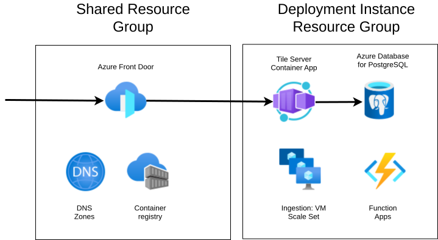
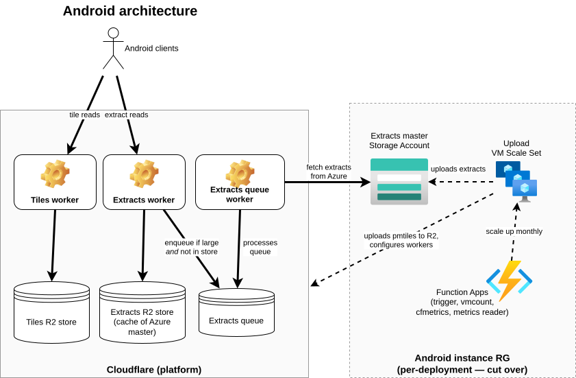

# iOS Architecture

This repository contains code that allows the deployment of a back end for the [Soundscape iPhone app](https://apps.apple.com/gb/app/soundscape/id6459021379). The app calculates its location, converts that to OpenStreetMap tile format, and uses that to build an HTTP GET request that retrieves a JSON file of [OpenStreetMap](https://www.openstreetmap.org) data showing known locations in the area. The back end (this repository) constructs, stores, and returns that data.

## Architecture summary

### Deployment instance resource group

Each deployed instance is in Azure, and contains the components below in a single resource group. Note that while there is normally only one such instance, a new one can be quickly created and cut over, to allow upgrades and code changes without risking an outage.

- The backend database is an [Azure Database for PostgreSQL](https://learn.microsoft.com/en-us/azure/postgresql/) instance, with the PostGIS extension installed.

- The actual web interface is served by the Tile Server [Azure Container App](https://learn.microsoft.com/en-us/azure/container-apps/overview), usually abreviated to `tilesrv`. This container app runs code that uses the `aiohttp` async web framework to provide a simple interface that queries the database. It expects a GET request in the `/z/x/y` format `/{zoom}/{x}/{y}.json`, where `zoom` must be 16. This app also has a `/metrics` interface which returns statistics about tiles served, errors, etc. and a `/probe/alive` interface to check if the service is up (though most metrics are actually passed through OpenTelemetry to Application Insights in practice).

- The database is populated by ingestion tooling consisting of a [VM Scale Set](https://learn.microsoft.com/en-us/azure/virtual-machine-scale-sets/overview), triggered by an [Azure Function](https://learn.microsoft.com/en-us/azure/azure-functions/functions-overview). This is described in detail below.

- There are various logging and diagnostics tooling components from the Azure Monitor family including [Log Analytics](https://learn.microsoft.com/en-us/azure/azure-monitor/logs/log-analytics-overview), and [Application Insights](https://learn.microsoft.com/en-us/azure/azure-monitor/app/app-insights-overview)

### Shared resource group

In addition to these per-instance components, there are some global components in a shared Resource Group. *The tooling in this repository does not cover creating this RG - it must already exist.*

- The entire thing is fronted by [Azure Front Door](https://learn.microsoft.com/en-us/azure/frontdoor/front-door-overview), which allows traffic to be cut over from one back end instance to another, manages SSL termination, and provides CDN capability and some metrics.

- There is a common Azure Container Registry that stores the container images for the Tile Server.

- There are multiple DNS zones that allow incoming traffic to be routed to the platform, specifically the following.

    - `prd2.soundscape.scottishtecharmy.org`: live traffic from the app

    - `soundscape.scottishtecharmy.org`: live traffic from an older version of the app

    - `tst.soundscape.scottishtecharmy.org`: test traffic, used to test new back end deployment instances

## High level flow

The high level flow is shown in the architecture diagram above.

- The app requests a URL requesting a tile - something like

        https://prd2.soundscape.scottishtecharmy.org/tiles/16/18748/25072.json

- The request arrives at the [Azure Front Door](https://learn.microsoft.com/en-us/azure/frontdoor/front-door-overview) instance. Front Door handles SSL termination for the domain, then forwards the request to the Tile Server Container App running in the deployment, changing the URL to

        https://TILESRV_DOMAIN/16/18748/25072.json

    Note that there is caching in Front Door - if the same request is received multiple times at the same POP, Front Door will return the cached value at this point.

- The Tile Server Container App receives the request, parses it, and builds the tile information from the database.

    - It builds tiles using the function `soundscape_tile` defined in `tilefunc.sql`.

    - That in turn relies on the bounding funtion `TileBBox` and various utility functions defined `postgis-vt-util.sql`.

## Ingestion

The data in the database is downloaded and ingested from public data at [Geofabrik](https://www.geofabrik.de). The process for this is as follows.

- There is a [VMSS](https://learn.microsoft.com/en-us/azure/virtual-machine-scale-sets/overview) which is normally of size 0. When scaled up to size 1, the VM installs and runs the [imposm3](https://github.com/omniscale/imposm3) tooling which performs a full download of all the data. `imposm3`

  - downloads all the data as `pbf` files;

  - imports into a temporary Postgres namespace called `import`;

  - then atomically rotates the data into the live namespace when it completes.

    This entire process takes about ten hours for the entire globe.

- The VMSS scaling is managed as follows.

    - Normally it is zero - i.e. no VM is running. VMs are not cheap.

    - Once a week, a function app with a timer trigger increases the scale to 1, so a single VM is instantiated. This trigger can also be fired manually through the portal to force an update.

    - The VM when created installs and runs the ingestion jobs through cloud init. If the run is successful, the ingestion job scales the VMSS down again, and the VM disappears.

# Android architecture

There are three components to the Android architecture.

1. There is a tileserver component that serves up tiles based on a protomap format, running in Cloudflare (but orchestrated from Azure).

2. There is an offline maps download component that again runs in Cloudflare, orchestrated from Azure.

3. There is a search component. This is not contained in this repository at all, and is not shown in the architecture diagram.

## Cloudflare components

There are a number of Cloudflare components.

- There are two R2 buckets.

    - The bucket parametrised as `PMTILES_BUCKET` (normally `pmtiles` for non-test deployments) contains the `pmtiles` file used for all audio data.

    - The bucket parametrised as `EXTRACTS_BUCKET` (normally `extracts` for non-test deployments) contains the downloadable extracts data for offline storage.

    In both of these buckets, there are timestamped directories, allowing new versions of data to be uploaded without impacting the existing data.

- There are then three workers used by the app.

    - The worker named `PMTILES_BUCKET` contains the worker defined in the [protomaps PMTiles repository](https://github.com/protomaps/PMTiles), which allows retrieval of tiles for the client containing Open Street Map data used for maps and audio. This worker takes a configuration parameter which defines which of the various pmtiles files in the bucket is currently in use.

    - The worker named `EXTRACTS_BUCKET` contains a worker that allows the download of extracts. Clients download a file `manifest.geojson.gz` which lists all of the extracts available, and can then download the extract that is most suitable for their location. Again, this worker takes a configuration parameter which indicates which version clients should be offered. However, the flow is somewhat different.

        - If the data is present in the R2 bucket already, then it is returned to the client.

        - If the data is not present in the R2 bucket, then an HTTP HEAD request is issued to the Azure storage. If the header shows that it is smaller than a threshold (currently 100MB) it is retrieved from Azure directly by the worker and stored in R2 before being returned to the client. *For simplicity, this flow is not shown in the architecture diagram.*

        - If the header shows that it is larger than that threshold, then a 503 error is returned with a `Retry-After` header. A message is put on the queue (see below).

        All extracts files are both named and datastamped, and the manifest file references datestamped files. Hence if the extracts list changes while a client is still processing the manifest, the old extracts are still available for a limited time (around twenty minutes). After this period, clients must download the manifest and recalculate which extract they should use.

    - The consumer worker `EXTRACTS_BUCKET-queue` monitors a queue, and receives messages whenever a request indicates that an extract was not available and was too large to download inline. When it receives such a message, it does the following.

        - If the extract file is now in R2, it stops immediately (as some other worker already did the job for it).

        - Otherwise, it retrieves the file from Azure and stores it in R2.

        This model is used because ordinary workers are terminated as soon as the client disconnects. Any download lasting more than a couple of seconds before data is available to stream is likely to end with the client disconnecting, and so the download never succeeds. The user impact is that the first download of any large extract fails, but should succeed on a later retry (for all users, not just the first to download).

- In addition to the workers `PMTILES_BUCKET`, `EXTRACTS_BUCKET`, and `EXTRACTS_BUCKET-queue`, there are three workers called `PMTILES_BUCKET-test`, `EXTRACTS_BUCKET-test`, and `EXTRACTS_BUCKET-queue-test`, used for testing during the upload process, not by clients. These use the same R2 buckets as the main workers.

## Uploading of new data from Azure

The data is uploaded and the workers are configured from tooling running in Azure. The architecture for this is very similar to the reloading model for iOS. There is a VMSS which runs at regular intervals, and when it runs, the tooling on it does the following.

- It sets up the `pmtiles` file. It does this as follows.

    - It downloads the raw data and builds the `pmtiles` file.

    - It uploads the `pmtiles` file to the R2 bucket used for tile retrieval, named `PMTILES_BUCKET` from the config (normally `pmtiles` for production).

    - It updates the worker `PMTILES_BUCKET-test` configuration to handle all requests from the new file and validates that it works.

    - It updates the production worker `PMTILES_BUCKET` configuration to use the new pmtiles file. This is the worker that handles requests from the app itself.

- The tooling then sets up extracts.

    - It checks out the relevant scripts.

    - The scripts generate all of the extracts; often several hundred GB.

    - Because uploading all that data would be very expensive, it stores them in a public Azure storage account using [internet routing](https://learn.microsoft.com/en-us/azure/virtual-network/ip-services/routing-preference-overview), rather than directly copying to R2.

    - It updates the worker `EXTRACTS_BUCKET-test` configuration to handle all requests from the new datestamped directory of extracts and validates that it is possible to download the manifest and a small number of extracts.

    - It updates the production worker `EXTRACTS_BUCKET` configuration to match the configuration tested above, and retests. This is the worker that handles requests from the app itself.

- Finally, after a pause, it tidies up old data, removing the previous versions from R2 and from Azure storage.
